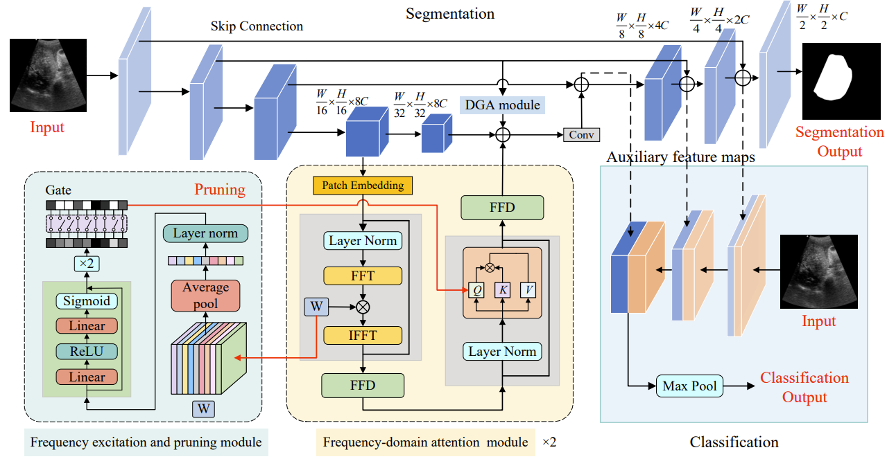
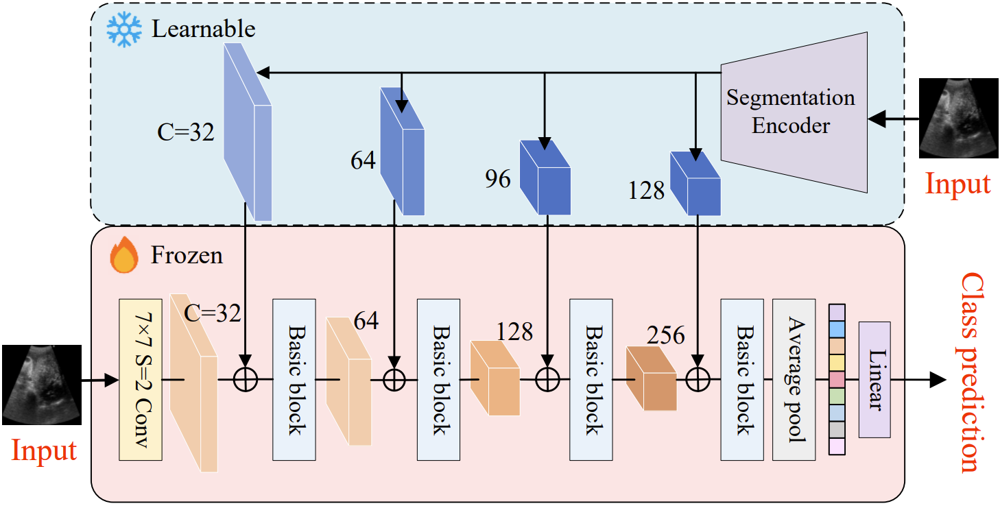
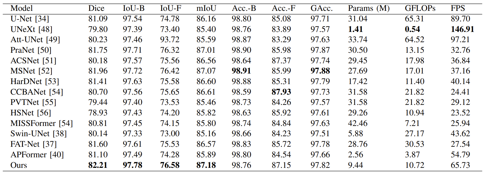
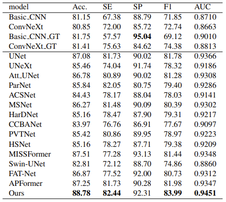

# FDAPNet
This repo is an implementation of the following paper: A Frequency-Domain Attention Pruning Model for Segmentation and Classification of Hepatic Echinococcosis in Ultrasound Images. The paper is currently under review at IEEE Journal of Biomedical and Health Informatics. We first open-sourced the FDAPNet model code and will release the full project code after the paper is accepted.

The detailed structure of the FDAPNet model is shown in the following figure:

  

The detailed structure of the classification part is shown as follows:

  

The segmentation performance of FDAPNet on ultrasound images of hepatic encopresis is as follows:

  

The following shows the classification performance of FDAPNet on ultrasound images of hepatic encopresis:

  

# Requirements
+ CUDA/CUDNN
+ pytorch>=1.10.1
+ torchvision>=0.11.2
